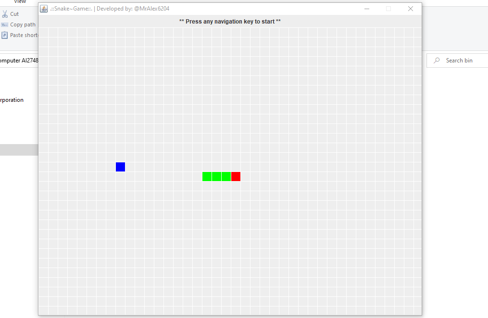
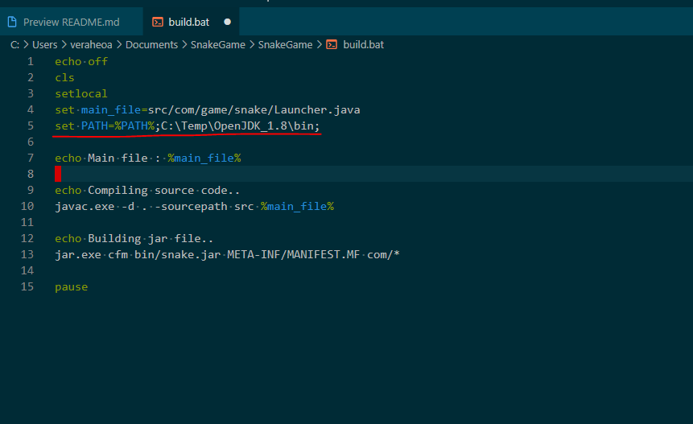
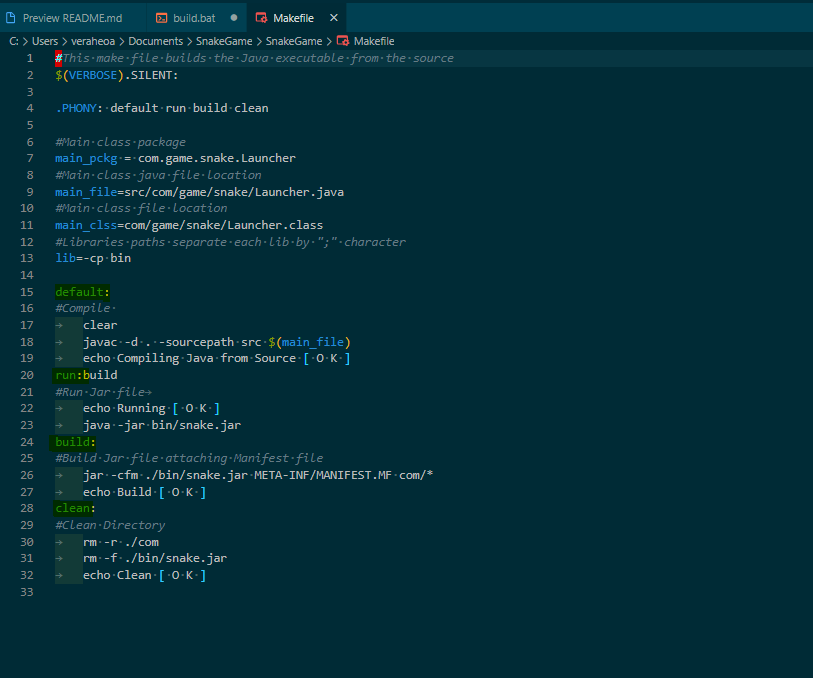

# Snake Game
This project is a didactic purpose and an example of how to create a basic game in java and compile a java project from scratch.

This project can easly be compiled in linux using the Makefile or in windows using the batch scrit built.bat

<b>Playing snake game</b>



<b>Build.bat</b><br>
To compile for windows execute this bat file.
But before make sure have installed Java SDK and configured in the PATH environment variable or edit the bat file and map the path to the SDK bin folder.



<br>
<b>Makefile</b><br>
To compile and run in linux execute the below commands in the terminal.
```
Compile
$ make
````
```
Generate the jar file
$ make build
````
```
Run the java game
$ make run
````
```
Clean the bin folder
$ make clean
````




